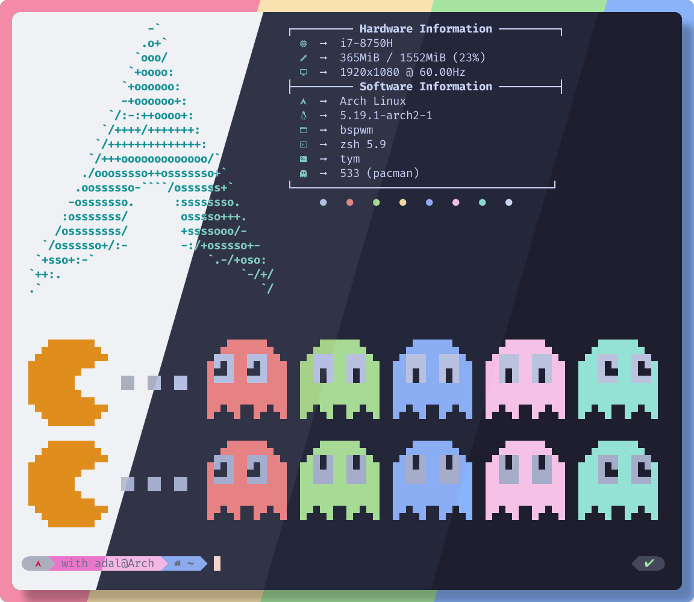

<h3 align="center">
	<br/>
	
	Catppuccin for <a href="https://github.com/endaaman/tym">Tym</a>
	
</h3>

<p align="center">
    <a href="https://github.com/catppuccin/tym/stargazers"></a>
    <a href="https://github.com/catppuccin/tym/issues"></a>
    <a href="https://github.com/catppuccin/tym/contributors"></a>
</p>

<p align="center">
  
</p>

## Usage

1. Run the following command:
  ```bash
  git clone https://github.com/catppuccin/tym.git ~/.config/tym/catppuccin && cp ~/.config/tym/catppuccin/theme.lua ~/.config/tym
  ```
  It will clone the repository and copy the appropiate files, if a `.config/tym` directory doesn't exist, it will be created.

2. To select a flavour, edit the `flavour` variable at the start of `~/.config/tym/catppuccin/init.lua`, default is "mocha", but other available options are "latte", "frappe" or "macchiato".
```lua
  local flavour = "mocha"
```

## 💝 Thanks to

- [justleoo](https://github.com/justleoo)
- [Adal Zanabria](https://github.com/AdalZanabria)

&nbsp;

<p align="center"></p>
<p align="center">Copyright &copy; 2021-present <a href="https://github.com/catppuccin" target="_blank">Catppuccin Org</a>
<p align="center"><a href="https://github.com/catppuccin/catppuccin/blob/main/LICENSE"></a></p>

